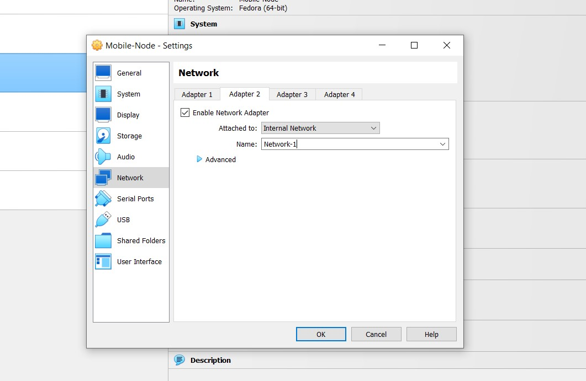
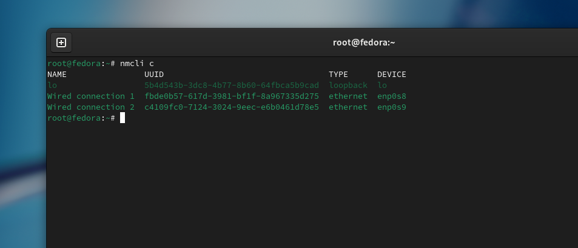

# Testbed Setup for Mobile IPv6

## Overview
This README provides step-by-step instructions for setting up a testbed environment for Mobile IPv6 using Fedora virtual machines in Oracle VirtualBox. The testbed will consist of four virtual machines: Fedora - HA, Fedora - MN, Fedora - Router, and Fedora - CN.

## Prerequisites
- Oracle VirtualBox: Download and install Oracle VirtualBox from [Oracle's official website](https://www.virtualbox.org/).
- Fedora OS: Download the Fedora ISO image from [Fedora's official website](https://fedoraproject.org/workstation/download).

## Setup Instructions
### Virtual Machine Setup
#### Virtual Machine Creation: 
Create four virtual machines in Oracle VirtualBox and name them accordingly:
   - Home-Agent
   - Mobile-Node
   - Router
   - Correspondent-Node

#### Network Interface Setup:
1. Set up the network interfaces of the virtual machines to use an internal network type within VirtualBox. This is done to ensure isolation and control over the network environment, which is crucial for testing purposes.



2. Name the network interface as mip-h (Home Network), mip-r (Router Network), mip-f (Foreign Network).

3. Assign the following network interface to the following Virtual Machine:
-   Home-Agent : Network-1, Network-2 (2 Interface)
-   Router : Network-2, Network-3 (2 Interface)
-   Correspondent-Node : Network-3 (1 Interface)
-   Mobile-Node : Network-1 (1 Interface)

#### Network Interface Configuration Commands (Only for Router and Home Agent):
1. Use the following commands to configure the network interface:
     ```
     nmcli c
     nmcli c edit $uuid
     ```
    The `nmcli` command is used to manage the network connections in linux. It is used to create, delete, activate and deactivate the network interface. To know more about this command visit [Configuring IP Networking with nmcli - RedHat](https://access.redhat.com/documentation/en-us/red_hat_enterprise_linux/7/html/networking_guide/sec-configuring_ip_networking_with_nmcli).

    
    
2. Replace `$uuid` with the UUID of the network connection you wish to configure. This will open up the NetworkManager editor for the selected connection, allowing you to modify its settings. Then the `nmcli>` interface will appear.

3. To save it use:
    ```
    save persistent
    ```
    in the `nmcli>` interface.

4. A file is formed at `/etc/NetworkManager/systemconnection/` named as `Wired connection 1.nmconnection`.

5. Open the file and do the following changes:
-   **Home Agent Interface 1:**
    ```
    address1=2001:db8:aaaa:3::1/64
    method=manual
    ```
Repeat the above step from 2 to 3 to create another file for network interface 2. Here the file name will be `Wired connection 2.nmconnection` and you have to do make changes in this file.
-   **Home Agent Interface 2:**
    ```
    address1=2001:db8:aaaa:2::2/64
    method=manual
    route1=2001:db8:aaaa:1::/64,2001:db8:aaaa:2::1
    ```
-   **Router Interface 1:**
    ```
    address1=2001:db8:aaaa:2::1/64
    method=manual
    route1=2001:db8:aaaa:3::/64,2001:db8:aaaa:2::2
    ```
-   **Router Interface 2:**
    ```
    address1=2001:db8:aaaa:1::1/64
    method=manual
    ```

### radvd installation

1. Download and Install the radvd using the following command:

```
dnf install radvd
```

> **Note**
- radvd should be installed only in Home Agent (HA), Router.

### radvd configuration
- Home Agent
```
interface enp0s8
{
    AdvSendAdvert on;
    AdvIntervalOpt off;
    AdvHomeAgentFlag on;
    MaxRtrAdvInterval 3;
    MinRtrAdvInterval 1;
    HomeAgentLifetime 10000;
    HomeAgentPreference 20;
    AdvHomeAgentInfo on;
    prefix 2001:db8:aaaa:3::1/64
    {
        AdvRouterAddr on;
        AdvOnLink on;
        AdvAutonomous on;
        AdvPreferredLifetime 10000;
        AdvValidLifetime 12000;
    };
};

```

- Router
```
interface enp0s9
{
    AdvSendAdvert on;
    AdvIntervalOpt on;
    MinRtrAdvInterval 1;
    MaxRtrAdvInterval 3;
    AdvHomeAgentFlag off;
    prefix 2001:db8:aaaa:1::1/64
    {
        AdvOnLink on;
        AdvAutonomous on;
        AdvRouterAddr on;
    };
};

```

### radvd start and on-bootup setting
Start the radvd in Home Agent and Router using:
```
systemctl start radvd
```
Make it on-boot startup using:
```
systemctl enable radvd
```
Check the radvd status using:
```
systemctl status radvd
```

### Kernel Parameter Configuration
1. Create a file named as `zz-mip6d.conf` in `/etc/sysctl.d/` directory to change the kernel configuration.
Here `zz` is used before the file name to give it higher priority.

2. Make the following changes in the `zz-mip6d.conf` file:
- Home Agent
```
net.ipv6.conf.all.forwarding = 1
net.ipv6.conf.all.autoconf = 0
net.ipv6.conf.all.accept_ra = 0
net.ipv6.conf.all.accept_redirects = 0

```
- Router
```
net.ipv6.conf.all.forwarding = 1
net.ipv6.conf.all.autoconf = 0
net.ipv6.conf.all.accept_ra = 0
net.ipv6.conf.all.accept_redirects = 0

```
- Mobile Node
```
net.ipv6.conf.all.forwarding = 0
net.ipv6.conf.all.autoconf = 1
net.ipv6.conf.all.accept_ra = 1
net.ipv6.conf.all.accept_redirects = 1

```
- Correspondence Node
```
net.ipv6.conf.all.forwarding = 0
net.ipv6.conf.all.autoconf = 1
net.ipv6.conf.all.accept_ra = 1
net.ipv6.conf.all.accept_redirects = 1

```

### mip6d installation
1. Download the rpm file of mip6d from [Linux@ CERN mipv6 - daemon website ](https://linuxsoft.cern.ch/cern/centos/7/updates/x86_64/repoview/mipv6-daemon.html)

2. Install the mip6d using the following command:
```
dnf install ~/Downloads/mipv6-daemon
```
> **Note**
- mip6d should be installed only in Home Agent (HA), Mobile Node (MN), Correspondent Node (CN).
### mip6d configuration
- Home Agent
```
NodeConfig HA;
DebugLevel 10;
DoRouteOptimizationCN enabled;
Interface "enp0s8";
UseMnHaIPsec disabled;

```
- Mobile Node
```
NodeConfig MN;
DebugLevel 10;
DoRouteOptimizationCN enabled;
Interface "enp0s8";
UseMnHaIPsec disabled;
DoRouteOptimizationMN enabled;
UseCnBuAck enabled;
MnHomeLink "enp0s8" {
    HomeAgentAddress 2001:db8:aaaa:3::1;
    HomeAddress 2001:db8:aaaa:3::2/64;
}

```
- Correspondence Node
```
NodeConfig CN;
DebugLevel 10;
DoRouteOptimizationCN enabled;

```

### Disabling the Firewall

Firewall should be disabled in all the virtual machines as it works as security barriers, controlling what traffic enters the network and what will exit it. It may block some traffic in tunnel.

By disabling we are simplifying the testing environment by eliminating the chances of filteration of traffic.

To disable the firewall use:
```
systemctl disable firewalld 
```

## Testing the Testbed
1. After doing the configuration in all Virtual machine, disable the NAT network in VM network settings.
2. Then disable the internet from the system and reboot the system.
3. Turn on the `fedora - HA` and `fedora - Router` virtual machine.
4. Check the `radvd status ` in the both machine using following command:
```
systemctl status radvd
```
5. Check the IPv6 address of each network interface using:
```
ip a
```
6. You will see the IPv6 address which you assigned to the network interface. If not, then there is a mistake.
7. Now Turn on the `fedora - MN` and `fedora - CN`.
8. Check the IPv6 address using:
```
ip a
```
9. Ping from one interface to other to check the reachability.
10. Start the mip6d by the following order:
- Correspondence Node
- Home Agent
- Mobile Node
11. Turn on the mobile IPv6 configuration in the virtual machines in the following order using:
```
systemctl start mip6d
```
12. Check the mip6d running status using:
```
systemctl status mip6d
```
13. Check the tunnel in Mobile Node using:
```
ifconfig
```
14. Ping from Correspondence Node to Mobile Node using the HoA.
15. Move the Mobile Node from the Home Network to Foreign Network.
16. Check the reachability.

## Conclusion
Following these instructions will help you set up a testbed environment for Mobile IPv6 using Fedora virtual machines in Oracle VirtualBox. Ensure to follow each step carefully to achieve the desired configuration.

