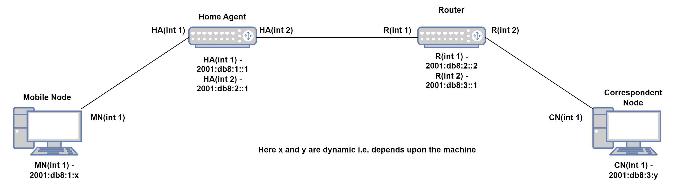
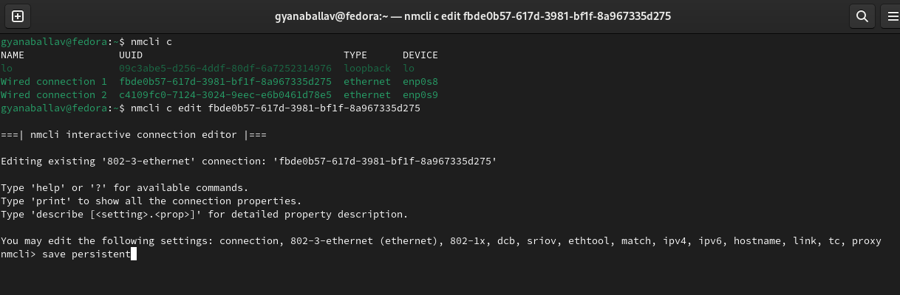
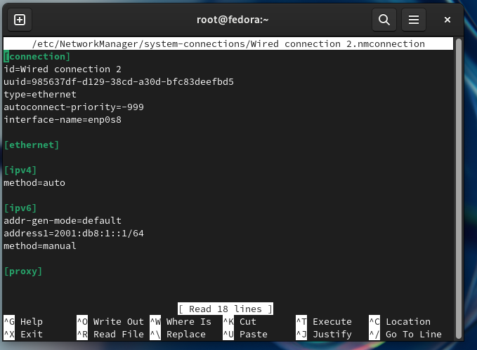
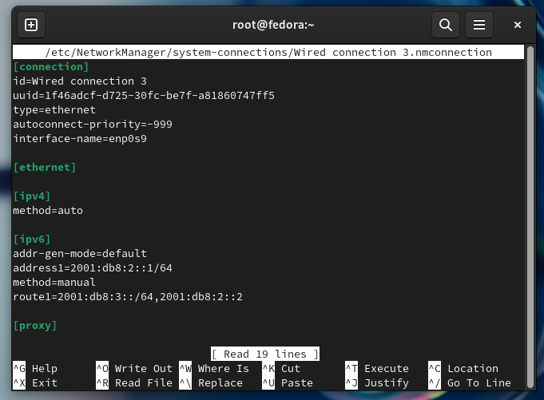

# Mobile IPv6 (MIPv6) Testbed



## Overview
This README provides step-by-step instructions for setting up a testbed environment for Mobile IPv6 using Fedora virtual machines in Oracle VirtualBox. The testbed will consist of four virtual machines: Home-Agent, Mobile-Node, Router, and Correspondent-Node.

## Prerequisites
- Oracle VirtualBox: Download and install Oracle VirtualBox from [Oracle's official website](https://www.virtualbox.org/).
- Fedora OS: Download the Fedora ISO image from [Fedora's official website](https://fedoraproject.org/workstation/download).

## Setup Instructions
### Virtual Machine Setup
#### Virtual Machine Creation: 
Create four virtual machines in Oracle VirtualBox and name them accordingly:
   - Home-Agent
   - Mobile-Node
   - Router
   - Correspondent-Node

#### Network Interface Setup:
1. Set up the network interfaces of the virtual machines to use an internal network type within VirtualBox. This is done to ensure isolation and control over the network environment, which is crucial for testing purposes.


2. Name the network interface as Network-1 (Home Network), Network-2 (Router Network), Network-3 (Foreign Network).

3. Attach the networks to the following Virtual Machines:
-   Home-Agent : Network-1, Network-2 (2 Adapters)
-   Router : Network-2, Network-3 (2 Adapters)
-   Correspondent-Node : Network-3 (1 Adapter)
-   Mobile-Node : Network-1 (1 Adapter)

## Network Interface Configuration on Home Agent and Router:
### Home Agent
1. Use the following commands to configure the network interface:
     ```
     nmcli c
     nmcli c edit $uuid
     ```
    The `nmcli` command is used to manage network connections in Linux. It is used to create, delete, activate and deactivate the network interface. To know more about this command visit [Configuring IP Networking with nmcli - RedHat](https://access.redhat.com/documentation/en-us/red_hat_enterprise_linux/7/html/networking_guide/sec-configuring_ip_networking_with_nmcli).

    
    
2. Replace `$uuid` with the UUID of the network connection you wish to configure. This will open up the NetworkManager editor for the selected connection, allowing you to modify its settings. Then the `nmcli>` interface will appear.



3. To save it use:
    ```
    save persistent
    ```
    in the `nmcli>` interface.

4. To quit from the `nmcli>` interface use
    ```
    quit
    ```

5. On saving, a file is formed at `/etc/NetworkManager/systemconnection/` named as `Wired connection 1.nmconnection`.
Note: The connection number may differ depending upon your socket.



6. Open the file in sudo mode and make the following changes:
-   **Home Agent Interface 1:**
    ```
    address1=2001:db8:1::1/64
    method=manual
    ```
Repeat the above step from 2 to 3 to create another file for network interface 2. Here the file name will be `Wired connection 2.nmconnection` and you will have to make changes in this file.


-   **Home Agent Interface 2:**
    ```
    address1=2001:db8:2::1/64
    method=manual
    route1=2001:db8:3::/64,2001:db8:2::2
    ```
### Router
Repeat the above step 1 onwards in Router as per the folowing changes.

-   **Router Interface 1:**
    ```
    address1=2001:db8:2::2/64
    method=manual
    route1=2001:db8:1::/64,2001:db8:2::1
    ```
-   **Router Interface 2:**
    ```
    address1=2001:db8:3::1/64
    method=manual
    ```

## Router Advertisement Daemon (radvd) Installation

1. Download and install the radvd using the following command:

```
sudo dnf install radvd
```

> **Note**
- radvd should be installed only in Home Agent (HA), Router.

### radvd configuration
Open the file named as `radvd.conf` in `/etc/` directory and do the following configuration:
- Home Agent
```
interface enp0s8
{
    AdvSendAdvert on;
    AdvIntervalOpt off;
    AdvHomeAgentFlag on;
    MaxRtrAdvInterval 3;
    MinRtrAdvInterval 1;
    HomeAgentLifetime 10000;
    HomeAgentPreference 20;
    AdvHomeAgentInfo on;
    prefix 2001:db8:1::1/64
    {
        AdvRouterAddr on;
        AdvOnLink on;
        AdvAutonomous on;
        AdvPreferredLifetime 10000;
        AdvValidLifetime 12000;
    };
};
```

- Router
```
interface enp0s9
{
    AdvSendAdvert on;
    AdvIntervalOpt on;
    MinRtrAdvInterval 1;
    MaxRtrAdvInterval 3;
    AdvHomeAgentFlag off;
    prefix 2001:db8:3::1/64
    {
        AdvOnLink on;
        AdvAutonomous on;
        AdvRouterAddr on;
    };
};
```

### radvd start and on-bootup setting
Start the radvd in Home Agent and Router using:
```
systemctl start radvd
```
Make it on-boot startup using:
```
systemctl enable radvd
```
Check the radvd status using:
```
systemctl status radvd
```

### Kernel Parameter Configuration
1. Create a file named `zz-test.conf` in `/etc/sysctl.d/` directory to change the kernel configuration.
Here `zz` is used before the file name, as systcl configuration files are sorted in lexicographical order. This means that any settings in this file will override the same settings in other files with prefixes that come earlier in lexicographic order, giving it a higher priority.

2. Make the following changes in the `zz-test.conf` file:
- Home Agent
```
net.ipv6.conf.all.forwarding = 1
net.ipv6.conf.all.autoconf = 0
net.ipv6.conf.all.accept_ra = 0
net.ipv6.conf.all.accept_redirects = 0
```
- Router
```
net.ipv6.conf.all.forwarding = 1
net.ipv6.conf.all.autoconf = 0
net.ipv6.conf.all.accept_ra = 0
net.ipv6.conf.all.accept_redirects = 0
```
- Mobile Node
```
net.ipv6.conf.all.forwarding = 0
net.ipv6.conf.all.autoconf = 1
net.ipv6.conf.all.accept_ra = 1
net.ipv6.conf.all.accept_redirects = 1
```
- Correspondence Node
```
net.ipv6.conf.all.forwarding = 0
net.ipv6.conf.all.autoconf = 1
net.ipv6.conf.all.accept_ra = 1
net.ipv6.conf.all.accept_redirects = 1
```
### Disabling the Firewall

The firewall should be disabled in all the virtual machines as it works as a security barrier, controlling what traffic enters the network and what will exit it. It may block some traffic in the tunnel.

By disabling it, we are simplifying the testing environment by eliminating the chances of filtration of traffic.

To disable the firewall, use:
```
systemctl disable firewalld 
```

### Disable the NAT / Internet
NAT should be disabled via the Network settings in VirtualBox for each VM in order to avoid the packet going into that interface which may lead to packet loss.
Alternatively, you may turn off the interface which is connected to the Internet in the settings for each of the VMs.


## MIPv6 Daemon (mip6d) Installation
1. Download the rpm file of mip6d from [Linux@ CERN mipv6 - daemon website ](https://linuxsoft.cern.ch/cern/centos/7/updates/x86_64/repoview/mipv6-daemon.html)

2. Install the mip6d using the following command:
```
sudo dnf install ~/Downloads/mipv6-daemon-1.0-5.el7.x86_64.rpm
```
> **Note**
- mip6d should be installed only in Home Agent (HA), Mobile Node (MN), and Correspondent Node (CN).
### mip6d configuration
Open the file named as `mip6d.conf` in `/etc/` directory and do the following configuration:
- Home Agent
```
NodeConfig HA;
DebugLevel 10;
DoRouteOptimizationCN enabled;
Interface "enp0s8";
UseMnHaIPsec disabled;
```
- Mobile Node
```
NodeConfig MN;
DebugLevel 10;
DoRouteOptimizationCN enabled;
Interface "enp0s8";
UseMnHaIPsec disabled;
DoRouteOptimizationMN enabled;
UseCnBuAck enabled;
MnHomeLink "enp0s8" {
    HomeAgentAddress 2001:db8:1::1;
    HomeAddress 2001:db8:1::2/64;
}
```
- Correspondence Node
```
NodeConfig CN;
DebugLevel 10;
DoRouteOptimizationCN enabled;
```


## Testing the Testbed
1. After doing the configuration in all Virtual machines, disable the NAT network in VM network settings.
2. Then disable the internet from the system and reboot the system.
3. Turn on the `Home-Agent` and `Router` virtual machine.
4. Check the `radvd status ` in both machines using the following command:
```
systemctl status radvd
```
5. Check the IPv6 address of each network interface using:
```
ip a
```
6. You will see the IPv6 address which you assigned to the network interface. If not, then there is a mistake.
7. Now Turn on the `Mobile-Node` and `Correspondent-Node`.
8. Check the IPv6 address using:
```
ip a
```
9. Ping from one interface to another to check the reachability.
10. Start the mip6d in the following order:
- Correspondence Node
- Home Agent
- Mobile Node
11. Turn on the mobile IPv6 configuration in the virtual machines in the following order using:
```
systemctl start mip6d
```
12. Check the mip6d running status using:
```
systemctl status mip6d
```
13. Check the tunnel in the Mobile Node using:
```
ifconfig
```
14. Ping from the Correspondence Node to the Mobile Node using the HoA.
15. Move the Mobile Node from the Home Network to the Foreign Network.
16. Check the reachability.

## Conclusion
Following these instructions will help you set up a testbed environment for Mobile IPv6 using Fedora virtual machines in Oracle VirtualBox. Ensure to follow each step carefully to achieve the desired configuration.

